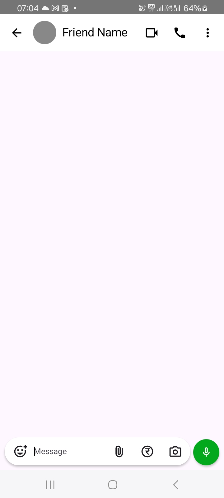
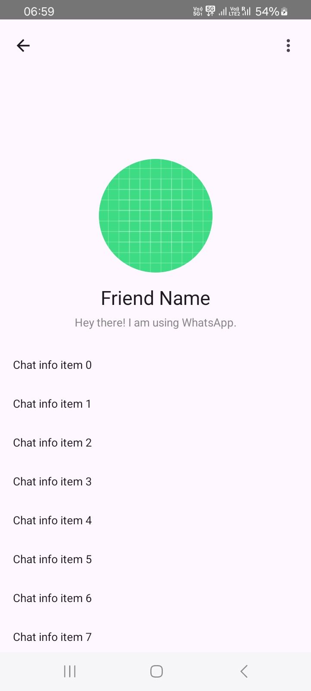
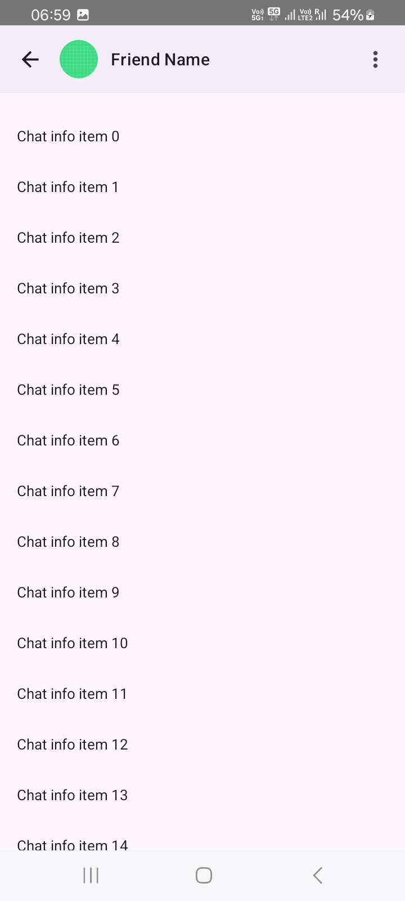

# UI Replication Using Jetpack Compose

Welcome to this repository!  
Here I am **recreating UI designs of well-known applications** such as:

- WhatsApp  

The goal of this project is to **improve UI design skills in Jetpack Compose** and help beginners understand how real-world app layouts can be implemented using modern Android development practices.

---

## Tech Stack

- **Jetpack Compose**
- **Material 3**
- **Kotlin**
- **Android Studio (latest)**

---

# Screenshots

Below you will find screenshots of each UI clone.  

## WhatsApp UI (Clone)

  
  
  
  
  
  

